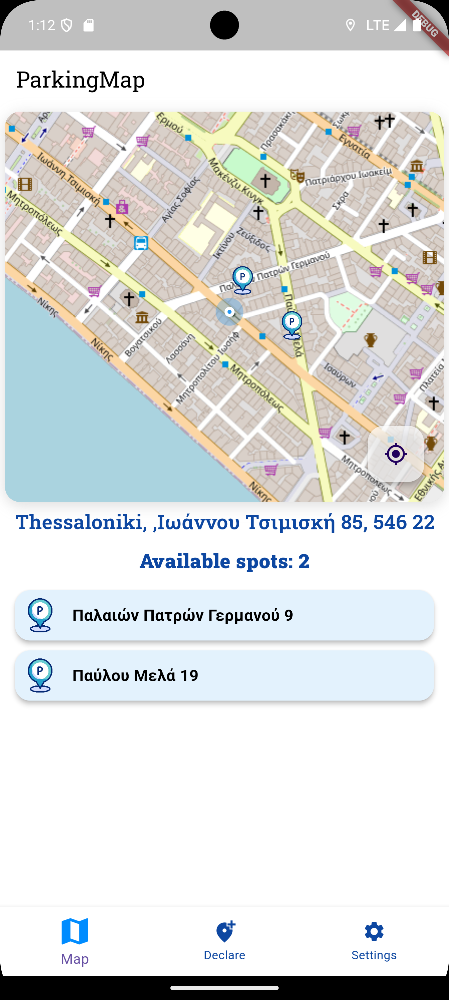
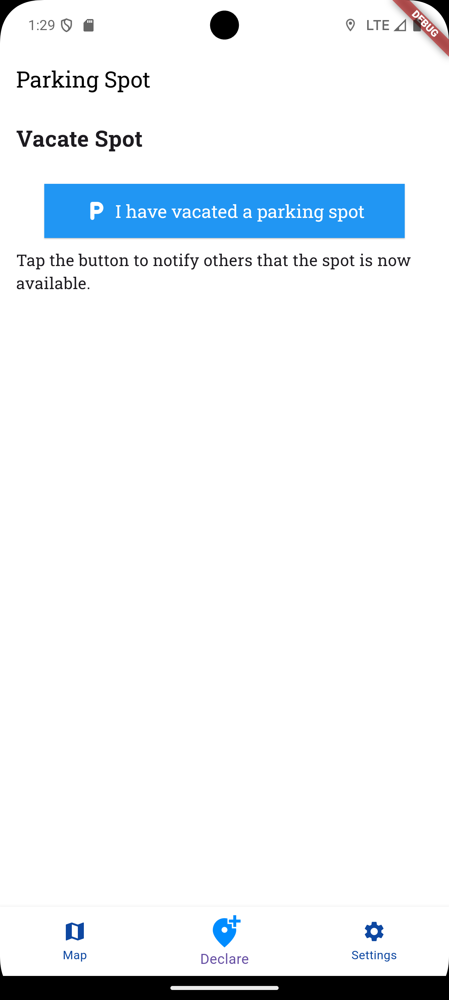
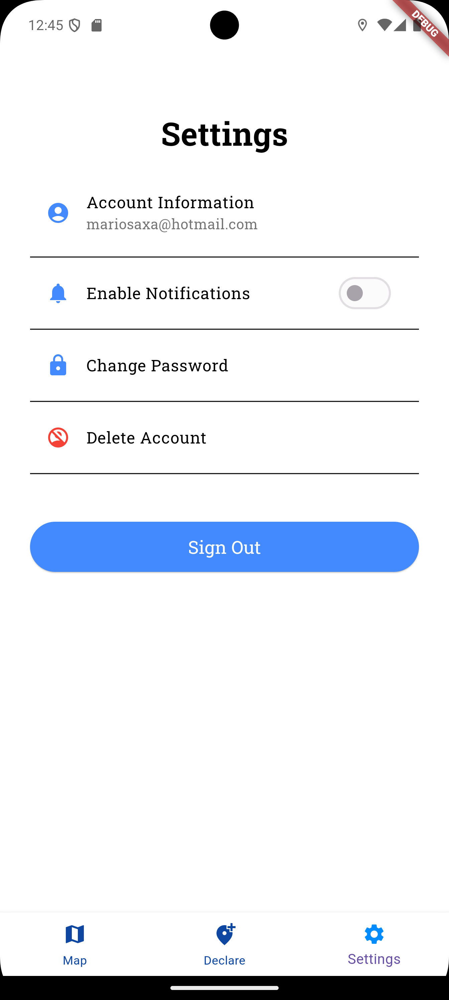
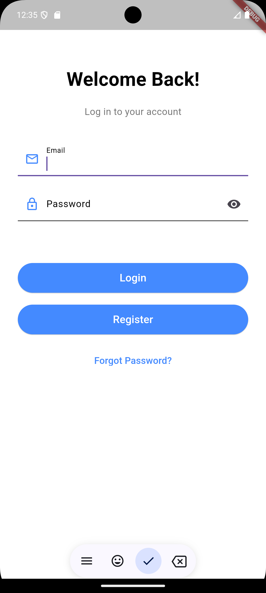

# HelpMePark Parking App 🚗

**HelpMePark Parking** is a mobile application designed to help users find and share parking spots easily. It allows users to declare when they're leaving a spot, and others can search the area to see available parking spots in real-time.

---

## Features ✨

- **Real-Time Parking Spot Sharing**: Mark your parking spot as available or unavailable in real-time.
- **Interactive Map**: View parking spots on a map with live updates.
- **Area-Based Notifications**: Get notified when new parking spots are available in your search area.
- **User Authentication**: Secure login and registration using Firebase Authentication.
- **Crash Reporting**: Firebase Crashlytics integrated for seamless issue tracking.
- **Backend API**: Node.js backend hosted on Render, connected to a MariaDB database on Clever Cloud.

---

## Technologies Used 🛠️

### Frontend (Flutter)
- [Flutter](https://flutter.dev)
- Firebase:
  - `firebase_core`
  - `firebase_auth`
  - `firebase_messaging`
  - `firebase_analytics`
  - `firebase_crashlytics`

### Backend (Node.js)
- Hosted on **Render**
- API Framework: [Express.js](https://expressjs.com/)
- Database: **MariaDB** hosted on Clever Cloud
- Logging : NewRelic

---
## How It Works 🚀

1. **User Authentication**: 
   - Users log in or register securely using Firebase Authentication.
   
2. **Parking Spot Sharing**:
   - Users can declare when they are leaving a parking spot, making it available for others to find.
   - Spots can also be marked as unavailable by long-pressing on a marker.

3. **Real-Time Updates**:
   - The app fetches available parking spots from the backend API and updates the map view in real-time.
   - Parking spots within the visible map area are listed for easy access.

4. **Notifications**:
   - Users searching within the same area are grouped into Firebase Messaging topics.
   - Notifications are sent when a new spot becomes available in their area.

5. **Backend**:
   - The backend, hosted on Render, processes user actions, manages parking spot data, and interacts with the MariaDB database hosted on Clever Cloud.

6. **Data Flow**:
   - The mobile app communicates with the backend using secure API endpoints.
   - The backend retrieves and updates parking spot data from the database as needed.

---
## Images

